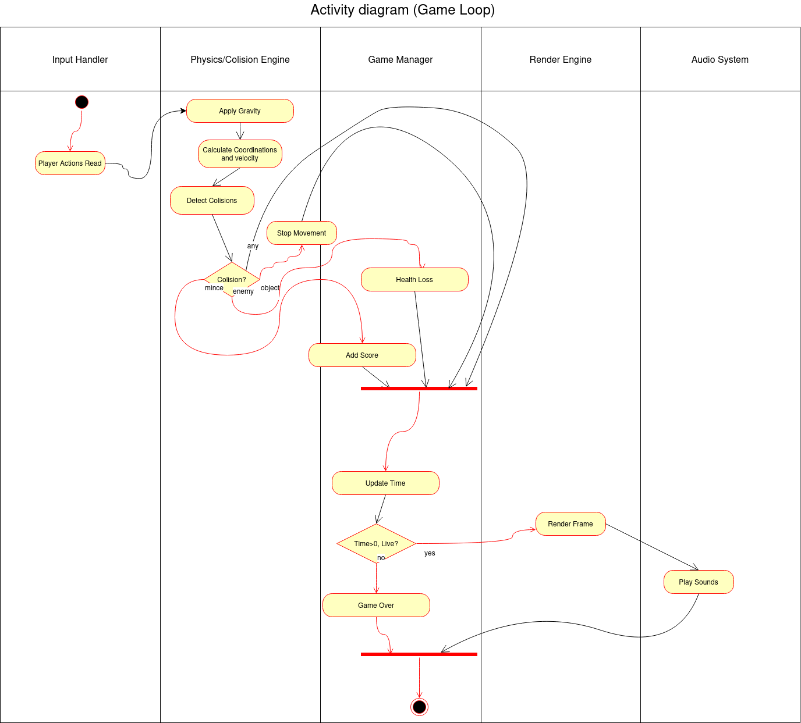
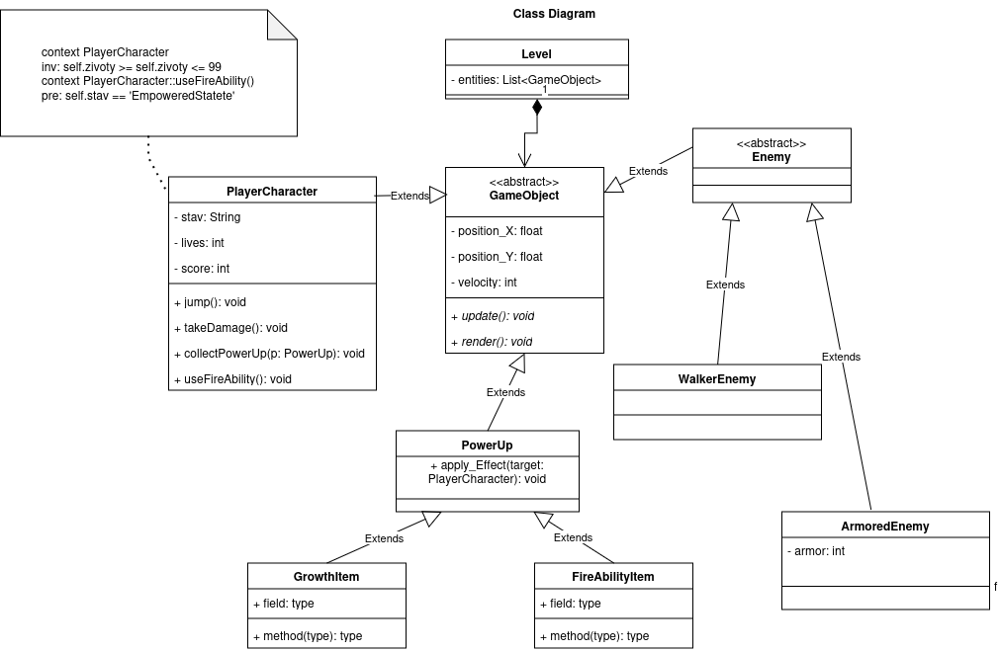
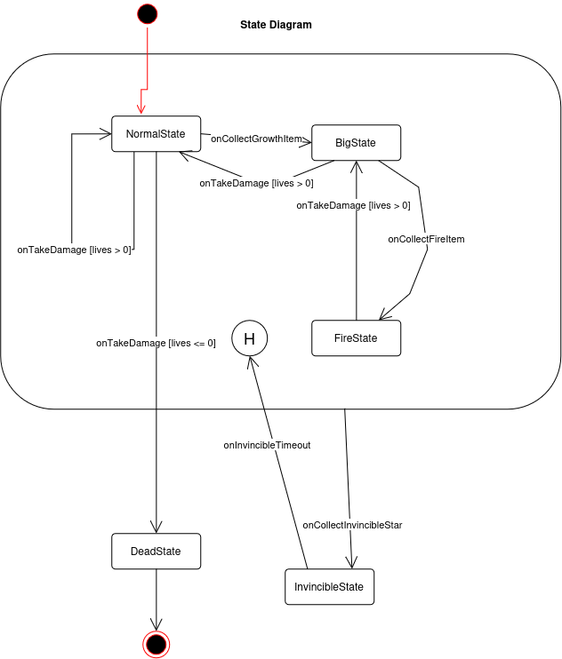
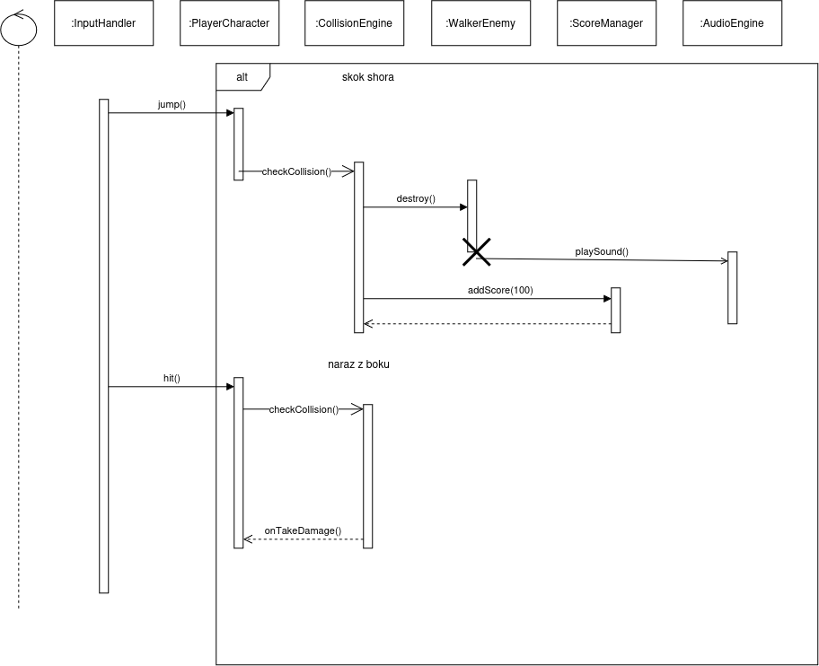

## Objektově orientovaný návrh

### Architektura herní logiky 2D plošinovky

#### Popis architektury a mechaniky plošinovky
Tento projekt představuje objektově orientovaný model herního enginu pro 2D plošinovku. Architektura je postavena na principu centrální herní smyčky (Game Loop), která v každém snímku zpracovává uživatelské vstupy, přepočítává fyzikální model, vyhodnocuje kolize a následně zajišťuje vizuální a zvukový výstup. 
Herní mechaniky zahrnují pohyb hlavní postavy, interakci se statickými překážkami a nepřáteli, a systém sbíratelných předmětů (Power-upů), které dynamicky mění stav a schopnosti hrdiny na základě událostmi řízeného stavového automatu.

#### Zdůvodnění návrhu řídicího toku (Diagram aktivit)
Diagram aktivit modeluje jeden snímek hlavní herní smyčky. Návrh klade důraz na striktní sekvenční zpracování kritických výpočtů: nejprve jsou načteny vstupy, následně je aplikována fyzika a teprve poté se vyhodnocují kolize a upravuje herní stav. Tím se předchází nekonzistencím v datech (tzv. race conditions).
Zásadním architektonickým rozhodnutím je využití uzlů Fork a Join na konci herní smyčky. Zpracování vykreslování (Render Engine) a odbavování fronty zvuků (Audio System) je odděleno do paralelních větví. Tento přístup zajišťuje, že se operace náročné na I/O a GPU mohou zpracovávat nezávisle a neblokují samotnou logiku hry.

#### Zdůvodnění návrhu tříd (Hierarchie dědičnosti a zapouzdření)
Datový model plně využívá pilířů objektově orientovaného programování:
- **Abstrakce a dědičnost:** Základním stavebním kamenem je abstraktní třída `GameObject`, která definuje sdílené fyzikální atributy (pozice X a Y, rychlost) a abstraktní metody `update()` a `render()`. Z ní dědí konkrétní `PlayerCharacter` a abstraktní rodič nepřátel `Enemy`. To umožňuje třídě `Level` spravovat všechny entity jednotně pomocí polymorfismu (kompozice s kardinalitou 1 : 0..*).
- **Zapouzdření:** Atributy entit (např. životy nebo aktuální stav hrdiny) jsou chráněny před přímým zásahem zvenčí. Modifikace probíhá výhradně přes definované veřejné metody (rozhraní), jako jsou `takeDamage()` nebo `collectPowerUp()`. 
- Třída `PowerUp` je rovněž navržena jako abstraktní rodič, aby znemožnila instanciaci nespecifikovaného předmětu, ze kterého následně dědí konkrétní modifikátory `GrowthItem` a `FireAbilityItem`.

#### Vyhodnocení kolizí a chybových/alternativních stavů (Sekvenční diagram)
Sekvenční diagram detailně rozebírá interakci `CollisionEngine` a `WalkerEnemy` pomocí fragmentu **ALT**, který definuje dva vzájemně se vylučující toky:
- **Úspěšný scénář (Skok shora):** Nepřítel je zničen (vyznačen křížkem destrukce) a hráči je přičteno skóre přes `ScoreManager`. Důležitým prvkem je asynchronní odeslání zprávy (vyjádřené otevřenou šipkou) do `AudioEngine` pro přehrání zvukového efektu. Systém tak nečeká na konec zvukové stopy a okamžitě pokračuje v běhu.
- **Chybový/Alternativní stav (Náraz z boku):** Negativní větev kolize, při které engin odesílá synchronní zprávu `onTakeDamage()` zpět instanci `PlayerCharacter`.

#### Diagramy
**Diagram aktivit:**

**Diagram tříd:**

**Stavový diagram:**

**Sekvenční diagram:**
