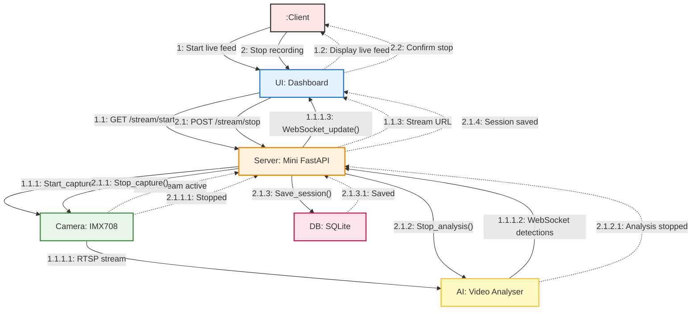

```mermaid
graph TB
    User[":Client"]
    UI["UI: Dashboard"]
    API["Server: Mini FastAPI"]
    CAM["Camera: IMX708"]
    AI["AI: Video Analyser"]
    DB["DB: SQLite"]

    User -->|"1: Start live feed"| UI
    UI -->|"1.1: GET /stream/start"| API
    API -->|"1.1.1: Start_capture()"| CAM
    CAM -->|"1.1.1.1: RTSP stream"| AI
    AI -->|"1.1.1.2: WebSocket detections"| API
    API -->|"1.1.1.3: WebSocket_update()"| UI
    CAM -.->|"1.1.2: Stream active"| API
    API -.->|"1.1.3: Stream URL"| UI
    UI -.->|"1.2: Display live feed"| User

    User -->|"2: Stop recording"| UI
    UI -->|"2.1: POST /stream/stop"| API
    API -->|"2.1.1: Stop_capture()"| CAM
    CAM -.->|"2.1.1.1: Stopped"| API
    API -->|"2.1.2: Stop_analysis()"| AI
    AI -.->|"2.1.2.1: Analysis stopped"| API
    API -->|"2.1.3: Save_session()"| DB
    DB -.->|"2.1.3.1: Saved"| API
    API -.->|"2.1.4: Session saved"| UI
    UI -.->|"2.2: Confirm stop"| User

    style User fill:#ffe6e6,stroke:#333,stroke-width:2px
    style UI fill:#e3f2fd,stroke:#1976d2,stroke-width:2px
    style API fill:#fff3e0,stroke:#f57c00,stroke-width:2px
    style CAM fill:#e8f5e9,stroke:#388e3c,stroke-width:2px
    style AI fill:#fff9c4,stroke:#fbc02d,stroke-width:2px
    style DB fill:#fce4ec,stroke:#c2185b,stroke-width:2px
```