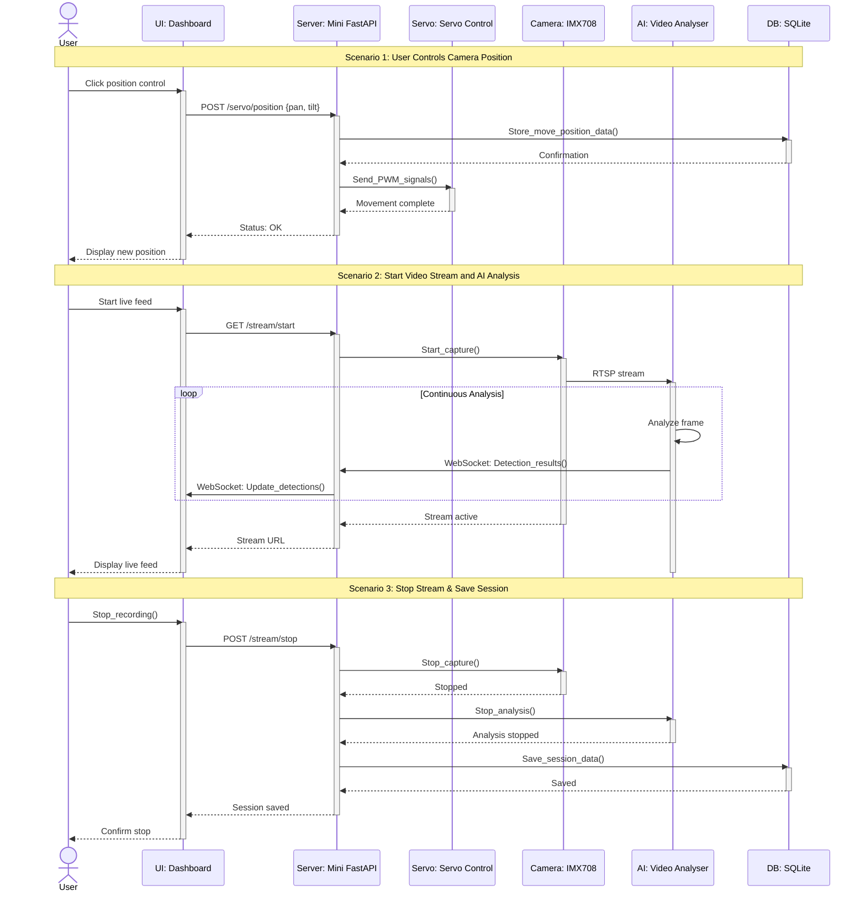

```mermaid
sequenceDiagram
    actor User
    participant UI as UI: Dashboard
    participant API as Server: Mini FastAPI
    participant SRV as Servo: Servo Control
    participant CAM as Camera: IMX708
    participant AI as AI: Video Analyser
    participant DB as DB: SQLite
    Note over User,DB: Scenario 1: User Controls Camera Position
    User->>UI: Click position control
    activate UI
    UI->>API: POST /servo/position {pan, tilt}
    activate API
    API->>DB: Store_move_position_data()
    activate DB
    DB-->>API: Confirmation
    deactivate DB
    API->>SRV: Send_PWM_signals()
    activate SRV
    SRV-->>API: Movement complete
    deactivate SRV
    API-->>UI: Status: OK
    deactivate API
    UI-->>User: Display new position
    deactivate UI
    Note over User,DB: Scenario 2: Start Video Stream and AI Analysis
    User->>UI: Start live feed
    activate UI
    UI->>API: GET /stream/start
    activate API
    API->>CAM: Start_capture()
    activate CAM
    CAM->>AI: RTSP stream
    activate AI
    loop Continuous Analysis
        AI->>AI: Analyze frame
        AI->>API: WebSocket: Detection_results()
        API->>UI: WebSocket: Update_detections()
    end
    CAM-->>API: Stream active
    deactivate CAM
    API-->>UI: Stream URL
    deactivate API
    UI-->>User: Display live feed
    deactivate UI
    deactivate AI
    Note over User,DB: Scenario 3: Stop Stream & Save Session
    User->>UI: Stop_recording()
    activate UI
    UI->>API: POST /stream/stop
    activate API
    API->>CAM: Stop_capture()
    activate CAM
    CAM-->>API: Stopped
    deactivate CAM
    API->>AI: Stop_analysis()
    activate AI
    AI-->>API: Analysis stopped
    deactivate AI
    API->>DB: Save_session_data()
    activate DB
    DB-->>API: Saved
    deactivate DB
    API-->>UI: Session saved
    deactivate API
    UI-->>User: Confirm stop
    deactivate UI
```