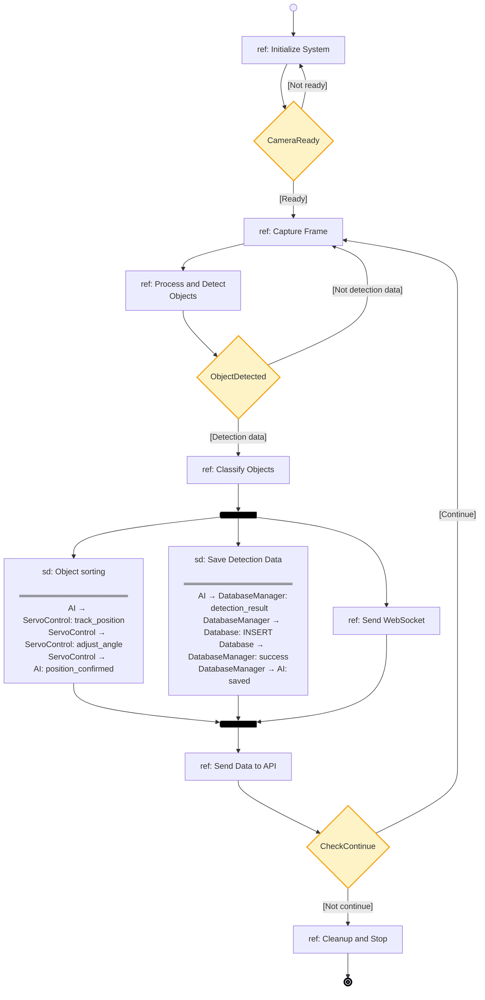

```mermaid
graph TB
    Start@{ shape: sm-circ, label: "Small start" } --> InitSystem[ref: Initialize System]
    InitSystem --> CameraReady@{shape: diamond, label:"Camera Ready?"}
    
    CameraReady -->|"[Ready]"| CaptureFrame[ref: Capture Frame]
    CameraReady -->|"[Not ready]"| InitSystem
    
    CaptureFrame --> ProcessFrame[ref: Process and Detect</br> Objects]
    
    ProcessFrame --> ObjectDetected@{shape: diamond, label:"Objects Detected?"}
    
    ObjectDetected -->|"[Detection data]"| ClassifyObjects[ref: Classify Objects]
    ObjectDetected -->|"[Not detection data]"| CaptureFrame
    
    ClassifyObjects --> par1@{ shape: fork, label: "Fork or Join" }
    
    par1 --> TrackingSeq["sd: Object sorting
    ═══════════════════
    AI → </br>ServoControl: track_position
    ServoControl → </br>ServoControl: adjust_angle
    ServoControl → </br>AI: position_confirmed"]
    
    par1 --> SaveData["sd: Save Detection Data
    ═══════════════════
    AI → DatabaseManager:</br> detection_result
    DatabaseManager → </br>Database: INSERT
    Database → </br>DatabaseManager: success
    DatabaseManager → AI:</br> saved"]
    
    par1 --> CreateSnapshot["ref: Send WebSocket"]
    
    TrackingSeq --> par2@{ shape: fork, label: "Fork or Join" }
    SaveData --> par2
    CreateSnapshot --> par2
    
    par2 --> SendAPI[ref: Send Data to API]
    
    SendAPI --> CheckContinue@{shape: diamond, label:"Continue Monitoring?"}
    
    CheckContinue -->|"[Continue]"| CaptureFrame
    CheckContinue -->|"[Not continue]"| Cleanup[ref: Cleanup and Stop]
    
    Cleanup --> End@{ shape: framed-circle, label: "Stop" }
    
    style Start fill:#4ade80,stroke:#16a34a,stroke-width:3px
    style End stroke:#000000,stroke-width:3px
    style CameraReady fill:#fef3c7,stroke:#f59e0b,stroke-width:2px
    style ObjectDetected fill:#fef3c7,stroke:#f59e0b,stroke-width:2px
    style CheckContinue fill:#fef3c7,stroke:#f59e0b,stroke-width:2px
    style par1 fill:#000000,stroke:#000000,stroke-width:3px
    style par2 fill:#000000,stroke:#000000,stroke-width:3px
    
```