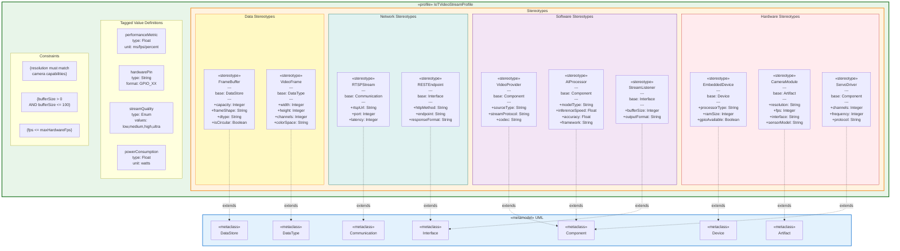

```mermaid
graph TB
    subgraph Profile["«profile» IoTVideoStreamProfile"]
        subgraph Stereotypes["Stereotypes"]
            direction TB
            subgraph HardwareStereotypes["Hardware Stereotypes"]
                EmbeddedDevice["«stereotype»<br/>EmbeddedDevice<br/>---<br/>base: Device<br/>---<br/>+processorType: String<br/>+ramSize: Integer<br/>+gpioAvailable: Boolean"]
                CameraModule["«stereotype»<br/>CameraModule<br/>---<br/>base: Artifact<br/>---<br/>+resolution: String<br/>+fps: Integer<br/>+interface: String<br/>+sensorModel: String"]
                ServoDriver["«stereotype»<br/>ServoDriver<br/>---<br/>base: Component<br/>---<br/>+channels: Integer<br/>+frequency: Integer<br/>+protocol: String"]
            end
            subgraph SoftwareStereotypes["Software Stereotypes"]
                VideoProvider["«stereotype»<br/>VideoProvider<br/>---<br/>base: Component<br/>---<br/>+sourceType: String<br/>+streamProtocol: String<br/>+codec: String"]
                AIProcessor["«stereotype»<br/>AIProcessor<br/>---<br/>base: Component<br/>---<br/>+modelType: String<br/>+inferenceSpeed: Float<br/>+accuracy: Float<br/>+framework: String"]
                StreamListener["«stereotype»<br/>StreamListener<br/>---<br/>base: Interface<br/>---<br/>+bufferSize: Integer<br/>+outputFormat: String"]
            end
            subgraph NetworkStereotypes["Network Stereotypes"]
                RTSPStream["«stereotype»<br/>RTSPStream<br/>---<br/>base: Communication<br/>---<br/>+rtspUrl: String<br/>+port: Integer<br/>+latency: Integer"]
                RESTEndpoint["«stereotype»<br/>RESTEndpoint<br/>---<br/>base: Interface<br/>---<br/>+httpMethod: String<br/>+endpoint: String<br/>+responseFormat: String"]
            end 
            subgraph DataStereotypes["Data Stereotypes"]
                FrameBuffer["«stereotype»<br/>FrameBuffer<br/>---<br/>base: DataStore<br/>---<br/>+capacity: Integer<br/>+frameShape: String<br/>+dtype: String<br/>+isCircular: Boolean"]
                VideoFrame["«stereotype»<br/>VideoFrame<br/>---<br/>base: DataType<br/>---<br/>+width: Integer<br/>+height: Integer<br/>+channels: Integer<br/>+colorSpace: String"]
            end
        end
        subgraph TaggedValues["Tagged Value Definitions"]
            TV1["performanceMetric<br/>type: Float<br/>unit: ms/fps/percent"]
            TV2["hardwarePin<br/>type: String<br/>format: GPIO_XX"]
            TV3["streamQuality<br/>type: Enum<br/>values: low,medium,high,ultra"]
            TV4["powerConsumption<br/>type: Float<br/>unit: watts"]
        end
        subgraph Constraints["Constraints"]
            C1["{resolution must match<br/>camera capabilities}"]
            C2["{bufferSize > 0<br/>AND bufferSize <= 100}"]
            C3["{fps <= maxHardwareFps}"]
        end
    end
    subgraph MetaModel["«metamodel» UML"]
        Device["«metaclass»<br/>Device"]
        Component["«metaclass»<br/>Component"]
        Interface["«metaclass»<br/>Interface"]
        Artifact["«metaclass»<br/>Artifact"]
        DataStore["«metaclass»<br/>DataStore"]
        DataType["«metaclass»<br/>DataType"]
        Communication["«metaclass»<br/>Communication"]
    end
    EmbeddedDevice -.->|extends| Device
    CameraModule -.->|extends| Artifact
    ServoDriver -.->|extends| Component
    VideoProvider -.->|extends| Component
    AIProcessor -.->|extends| Component
    StreamListener -.->|extends| Interface
    RTSPStream -.->|extends| Communication
    RESTEndpoint -.->|extends| Interface
    FrameBuffer -.->|extends| DataStore
    VideoFrame -.->|extends| DataType
    
    style Profile fill:#e8f5e9,stroke:#2e7d32,stroke-width:3px
    style Stereotypes fill:#fff3e0,stroke:#f57c00,stroke-width:2px
    style MetaModel fill:#e3f2fd,stroke:#1976d2,stroke-width:2px
    style HardwareStereotypes fill:#ffebee,stroke:#c62828,stroke-width:1px
    style SoftwareStereotypes fill:#f3e5f5,stroke:#6a1b9a,stroke-width:1px
    style NetworkStereotypes fill:#e0f2f1,stroke:#00695c,stroke-width:1px
    style DataStereotypes fill:#fff9c4,stroke:#f57f17,stroke-width:1px
```