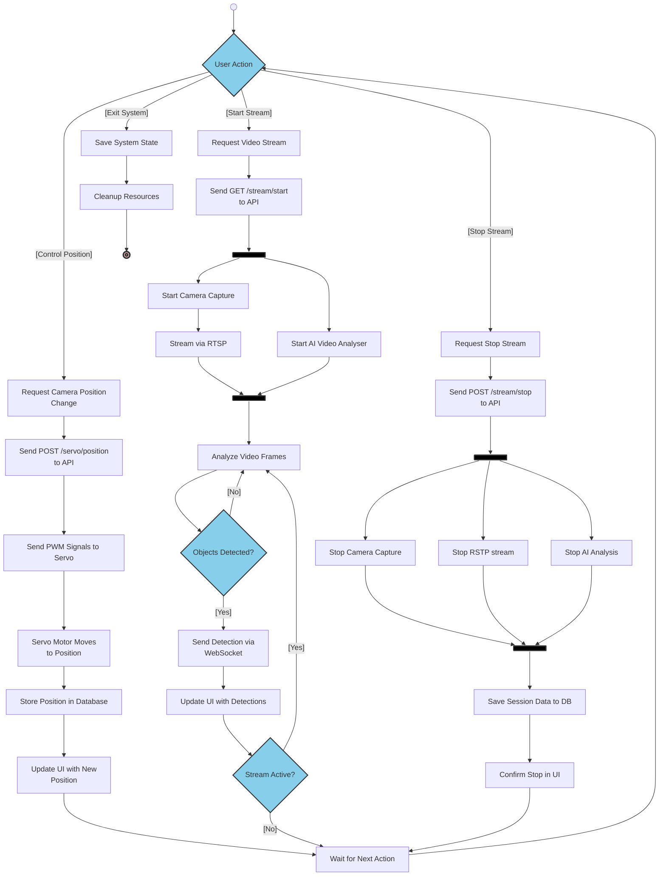

```mermaid
flowchart TD
    Start@{ shape: sm-circ, label: "Small start" } --> UserAction{User Action}    
    %% Control Camera Position Flow
    UserAction -->|"[Control Position]"| RequestPosition[Request Camera Position</br> Change]
    RequestPosition --> SendPositionAPI["Send POST /servo/position</br>to API"]
    SendPositionAPI --> SendPWM[Send PWM Signals to Servo]
    SendPWM --> MoveServo[Servo Motor Moves </br> to Position]
    MoveServo --> StorePosition[Store Position in Database]
    StorePosition --> UpdateUI1[Update UI with New</br> Position]
    UpdateUI1 --> WaitForAction
    
    %% Start Video Stream Flow
    UserAction -->|"[Start Stream]"| RequestStream[Request Video Stream]
    RequestStream --> SendStreamAPI[Send GET /stream/start</br> to API]
    SendStreamAPI --> Fork1@{ shape: fork, label: "Fork or Join" }
    
    Fork1 --> StartCapture[Start Camera Capture]
    StartCapture --> StreamRTSP[Stream via RTSP]
    
    Fork1 --> StartAI[Start AI Video Analyser]
    
    StreamRTSP --> Join3@{ shape: fork, label: "Fork or Join" }
    StartAI --> Join3

    Join3 --> AnalyzeFrame[Analyze Video Frames]
    
    AnalyzeFrame --> DetectObjects{Objects Detected?}
    DetectObjects -->|"[Yes]"| SendDetection[Send Detection via</br> WebSocket]
    DetectObjects -->|"[No]"| AnalyzeFrame
    
    SendDetection --> UpdateUI2[Update UI with Detections]
    UpdateUI2 --> CheckStreamActive{Stream Active?}
    CheckStreamActive -->|"[Yes]"| AnalyzeFrame
    CheckStreamActive -->|"[No]"| WaitForAction
    
    %% Stop Stream Flow
    UserAction -->|"[Stop Stream]"| RequestStop[Request Stop Stream]
    RequestStop --> SendStopAPI[Send POST /stream/stop</br> to API]
    SendStopAPI --> Fork2@{ shape: fork, label: "Fork or Join" }
    
    Fork2 --> StopCamera[Stop Camera Capture]
    Fork2 --> StopRSTP[Stop RSTP stream]
    Fork2 --> StopAI[Stop AI Analysis]
    
    StopCamera --> Join2@{ shape: fork, label: "Fork or Join" }
    StopRSTP --> Join2
    StopAI --> Join2
   
    Join2 --> SaveSession[Save Session Data to DB]
    SaveSession --> UpdateUI3[Confirm Stop in UI]
    UpdateUI3 --> WaitForAction
    
    %% Exit Flow
    UserAction -->|"[Exit System]"| SaveState[Save System State]
    SaveState --> Cleanup[Cleanup Resources]
    Cleanup --> End@{ shape: framed-circle, label: "Stop" }
    
    WaitForAction[Wait for Next Action] --> UserAction
    
    style Start fill:#000000,stroke:#333,stroke-width:3px
    style End fill:#ffcccb,stroke:#333,stroke-width:3px
    style Fork1 fill:#000000,stroke:#333,stroke-width:2px
    style Fork2 fill:#000000,stroke:#333,stroke-width:2px
    style Join2 fill:#000000,stroke:#333,stroke-width:2px
    style Join3 fill:#000000,stroke:#333,stroke-width:2px
    style UserAction fill:#87ceeb,stroke:#333,stroke-width:2px
    style DetectObjects fill:#87ceeb,stroke:#333,stroke-width:2px
    style CheckStreamActive fill:#87ceeb,stroke:#333,stroke-width:2px
```