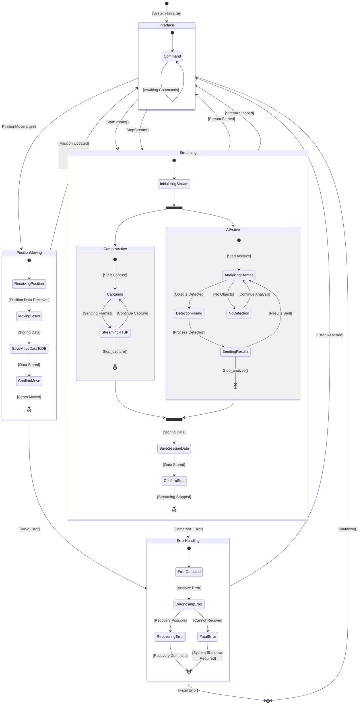

```mermaid
stateDiagram-v2
    [*] --> Interface: [System Initialize]
    state Interface {
        [*] --> Command
        Command --> Command: [Awaiting Commands]
    }
    Interface --> PositionMoving: PositionMove(angle)
    Interface --> Streaming: StartStream()
    state PositionMoving {
        [*] --> ReceivingPosition
        ReceivingPosition --> MovingServo: [Position Data Received]
        MovingServo -->  SaveMoveDataToDB: [Storing Data]
        SaveMoveDataToDB -->  ConfirmMove: [Data Stored]
        ConfirmMove --> [*]: [Servo Moved]
    }
    PositionMoving --> Interface: [Position Updated]</br></br></br></br></br>
    state Streaming {
        [*] --> InitializingStream
        state fork_state <<fork>>
        InitializingStream --> fork_state
        fork_state --> CameraActive
        fork_state --> AIActive
        state CameraActive {
            [*] --> Capturing: [Start Capture]
            Capturing --> StreamingRTSP: [Sending Frames]
            StreamingRTSP --> Capturing: [Continue Capture]
            StreamingRTSP --> [*]: Stop_capture()
        }
        state AIActive {
            [*] --> AnalyzingFrames: [Start Analyze]
            AnalyzingFrames --> DetectionFound: [Objects Detected]
            AnalyzingFrames --> NoDetection: [No Objects]
            DetectionFound --> SendingResults: [Process Detection]
            NoDetection --> AnalyzingFrames: [Continue Analysis]
            SendingResults --> AnalyzingFrames: [Results Sent]
            SendingResults --> [*]: Stop_analyse()
        }
        state join_state <<join>>
        CameraActive --> join_state
        AIActive --> join_state
        
        join_state --> SaveSessionData: [Storing Data]
        SaveSessionData --> ConfirmStop: [Data Stored]
        ConfirmStop --> [*]: [Streaming Stopped]
    }
    Streaming --> Interface: [Stream Started]
    Interface --> Streaming: StopStream()
    Streaming --> Interface: [Stream Stopped]
    state ErrorHandling {
        [*] --> ErrorDetected
        ErrorDetected --> DiagnosingError: [Analyze Error]
        DiagnosingError --> RecoveringError: [Recovery Possible]
        DiagnosingError --> FatalError: [Cannot Recover]
        RecoveringError --> [*]: [Recovery Complete]
        FatalError --> [*]: [System Shutdown</br> Required]
    }
    PositionMoving --> ErrorHandling: [Servo Error]
    Streaming --> ErrorHandling: [Camera/AI Error]
    ErrorHandling --> Interface: [Error Resolved]
    ErrorHandling --> [*]: [Fatal Error]
    Interface --> [*]: Shutdown()
    

```