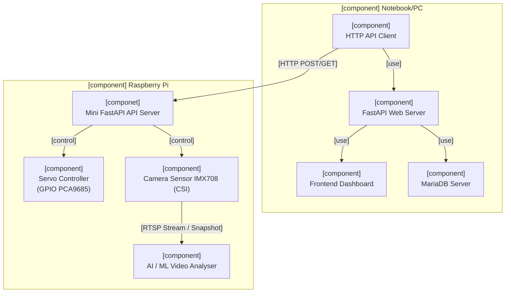

### Component diagram

```mermaid
graph TD
    subgraph Notebook_PC["[component] Notebook/PC"]
        A1["[component]</br> FastAPI Web Server"]
        A4["[component]</br> HTTP API Client"]
        A1 -->|"[use]"| A3["[component]</br> Frontend Dashboard"]
        A2["[component]</br> MariaDB Server"]
    end

    subgraph RaspberryPi["[component] Raspberry Pi"]
        B1["[componet]</br>Mini FastAPI API Server"]
        B2["[component]</br>Servo Controller<br/>(GPIO PCA9685)"]
        B3["[component]</br>Camera Sensor IMX708 (CSI)"]
        B4["[component]</br> AI / ML Video Analyser"]
        B1 -->|"[control]"| B2
        B1 -->|"[control]"| B3
    end

    A4 -->|"[HTTP POST/GET]"| B1
    B3 -->|"[RTSP Stream / Snapshot]"| B4
    A4 -->|"[use]"| A1 
    A1 -->|"[use]"| A2 
```

