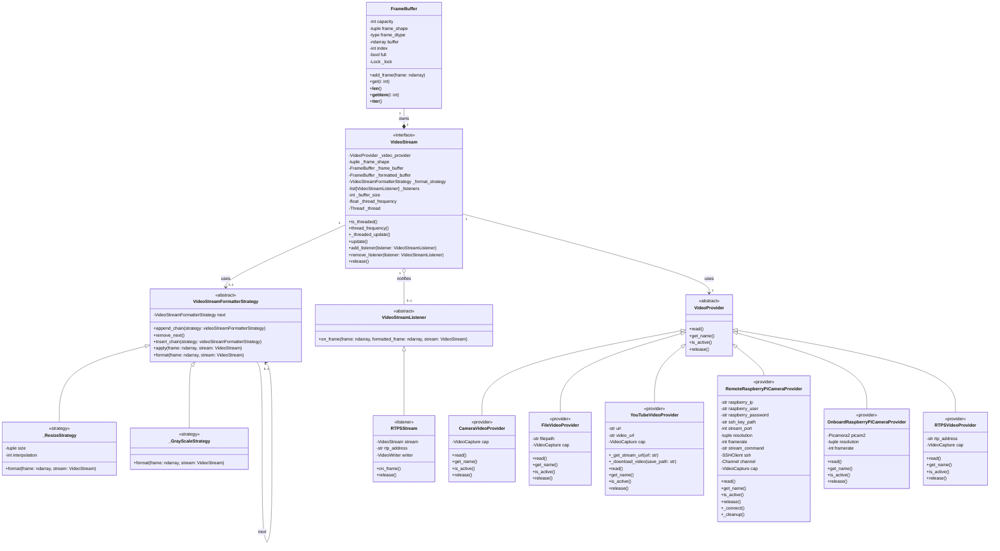

### Class diagram

```mermaid
classDiagram
%% =============================
%%  FRAMEBUFFER
%% =============================
class FrameBuffer {
    -int capacity
    -tuple frame_shape
    -type frame_dtype
    -ndarray buffer
    -int index
    -bool full
    -Lock _lock
    +add_frame(frame: ndarray)
    +get(i: int)
    +__len__()
    +__getitem__(i: int)
    +__iter__()
}

%% =============================
%%  LISTENER HIERARCHY
%% =============================
class VideoStreamListener {
    <<abstract>>
    +on_frame(frame: ndarray, formatted_frame: ndarray, stream: VideoStream)
}
class RTPSStream {
    <<listener>>
    -VideoStream stream
    -str rtp_address
    -VideoWriter writer
    +on_frame()
    +release()
}
VideoStreamListener <|-- RTPSStream

%% =============================
%%  FORMATTER STRATEGY CHAIN
%% =============================
class VideoStreamFormatterStrategy {
    <<abstract>>
    -VideoStreamFormatterStrategy next
    +append_chain(strategy: videoStreamFormatterStrategy)
    +remove_next()
    +insert_chain(strategy: videoStreamFormatterStrategy)
    +apply(frame: ndarray, stream: VideoStream)
    +format(frame: ndarray, stream: VideoStream)
}
class _ResizeStrategy {
    <<strategy>>
    -tuple size
    -int interpolation
    +format(frame: ndarray, stream: VideoStream)
}
class _GrayScaleStrategy {
    <<strategy>>
    +format(frame: ndarray, stream: VideoStream)
}
VideoStreamFormatterStrategy <|-- _ResizeStrategy
VideoStreamFormatterStrategy <|-- _GrayScaleStrategy
%% Cardinality: strategy chain (0..1 next)
VideoStreamFormatterStrategy --> "0..1" VideoStreamFormatterStrategy : next

%% =============================
%%  VIDEOSTREAM CORE
%% =============================
class VideoStream {
    <<interface>>
    -VideoProvider _video_provider
    -tuple _frame_shape
    -FrameBuffer _frame_buffer
    -FrameBuffer _formatted_buffer
    -VideoStreamFormatterStrategy _format_strategy
    -list[VideoStreamListener] _listeners
    -int _buffer_size
    -float _thread_frequency
    -Thread _thread
    +is_threaded()
    +thread_frequency()
    +_threaded_update()
    +update()
    +add_listener(listener: VideoStreamListener)
    +remove_listener(listener: VideoStreamListener)
    +release()
}
%% Composition: FrameBuffer --* VideoStream (1..2)
FrameBuffer "1" --* "2" VideoStream : owns
%% Association: format strategy (0..1)
VideoStream "1" --> "0..1" VideoStreamFormatterStrategy : uses
%% Aggregation: listeners 0..n
VideoStream "1" o-- "0..n" VideoStreamListener : notifies
%% Association: provider 1..1
VideoStream "1" --> "1" VideoProvider : uses

%% =============================
%%  PROVIDER HIERARCHY
%% =============================
class VideoProvider {
    <<abstract>>
    +read()
    +get_name()
    +is_active()
    +release()
}
class CameraVideoProvider {
    <<provider>>
    -VideoCapture cap
    +read()
    +get_name()
    +is_active()
    +release()
}
class FileVideoProvider {
    <<provider>>
    -str filepath
    -VideoCapture cap
    +read()
    +get_name()
    +is_active()
    +release()
}
class YouTubeVideoProvider {
    <<provider>>
    -str url
    -str video_url
    -VideoCapture cap
    +_get_stream_url(url: str)
    +_download_video(save_path: str)
    +read()
    +get_name()
    +is_active()
    +release()
}
class RemoteRaspberryPiCameraProvider {
    <<provider>>
    -str raspberry_ip
    -str raspberry_user
    -str raspberry_password
    -str ssh_key_path
    -int stream_port
    -tuple resolution
    -int framerate
    -str stream_command
    -SSHClient ssh
    -Channel channel
    -VideoCapture cap
    +read()
    +get_name()
    +is_active()
    +release()
    +_connect()
    +_cleanup()
}
class OnboardRaspberryPiCameraProvider {
    <<provider>>
    -Picamera2 picam2
    -tuple resolution
    -int framerate
    +read()
    +get_name()
    +is_active()
    +release()
}
class RTPSVideoProvider {
    <<provider>>
    -str rtp_address
    -VideoCapture cap
    +read()
    +get_name()
    +is_active()
    +release()
}
%% Provider inheritance
VideoProvider <|-- CameraVideoProvider
VideoProvider <|-- FileVideoProvider
VideoProvider <|-- YouTubeVideoProvider
VideoProvider <|-- RemoteRaspberryPiCameraProvider
VideoProvider <|-- OnboardRaspberryPiCameraProvider
VideoProvider <|-- RTPSVideoProvider
```