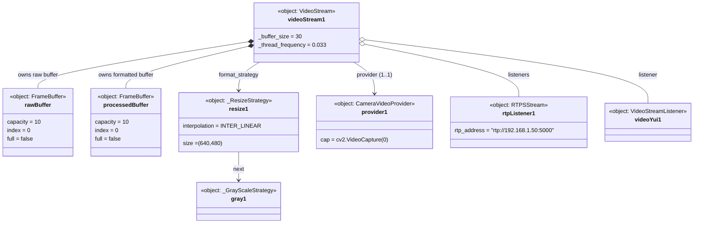

### Object diagram

```mermaid
classDiagram

%% OBJECTS (INSTANCES)
%% VideoStream instance
class videoStream1 {
    <<object: VideoStream>>
    _buffer_size = 30
    _thread_frequency = 0.033
}
%% Framebuffer instances
class rawBuffer {
    <<object: FrameBuffer>>
    capacity = 10
    index = 0
    full = false
}
class processedBuffer {
    <<object: FrameBuffer>>
    capacity = 10
    index = 0
    full = false
}
%% Strategy chain instances
class resize1 {
    <<object: _ResizeStrategy>>
    size = (640,480)
    interpolation = INTER_LINEAR
}
class gray1 {
    <<object: _GrayScaleStrategy>>
}
%% Provider instance
class provider1 {
    <<object: CameraVideoProvider>>
    cap = cv2.VideoCapture(0)
}
%% Listener instance (example RTPS stream)
class rtpListener1 {
    <<object: RTPSStream>>
    rtp_address = "rtp://192.168.1.50:5000"
}
class videoYui1 {
    <<object: VideoStreamListener>>
    <<UI listener>>
}

%% LINKS BETWEEN OBJECTS
%% VideoStream composition with buffers
videoStream1 *-- rawBuffer : owns raw buffer
videoStream1 *-- processedBuffer : owns formatted buffer
%% VideoStream uses provider
videoStream1 --> provider1 : provider (1..1)
%% Listeners aggregation (0..n)
videoStream1 o-- rtpListener1 : listeners
%% Strategy chain links
videoStream1 --> resize1 : format_strategy
resize1 --> gray1 : next
%% listener(s)
videoStream1 o-- videoYui1 : listener
```