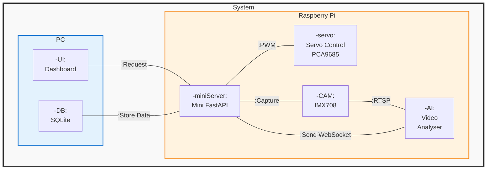

```mermaid
graph TB
    subgraph System["System"]
        subgraph RPi["Raspberry Pi"]
            API["-miniServer:<br/>Mini FastAPI"]
            SRV["-servo:<br/>Servo Control<br/>PCA9685"]
            CAM["-CAM:<br/>IMX708"]
            AI["-AI:<br/>Video<br/>Analyser"]
            API ---|:PWM| SRV
            API ---|:Capture| CAM
            CAM ---|:RTSP| AI
        end
        subgraph PC["PC"]
            UI["-UI:<br/>Dashboard"]
            DB["-DB:<br/>SQLite"]
        end
        UI ---|:Request| API
        DB ---|:Store Data| API
        AI ---|:Send WebSocket| API
    end
    style System fill:#f9f9f9,stroke:#333,stroke-width:3px
    style PC fill:#e3f2fd,stroke:#1976d2,stroke-width:2px
    style RPi fill:#fff3e0,stroke:#f57c00,stroke-width:2px
```