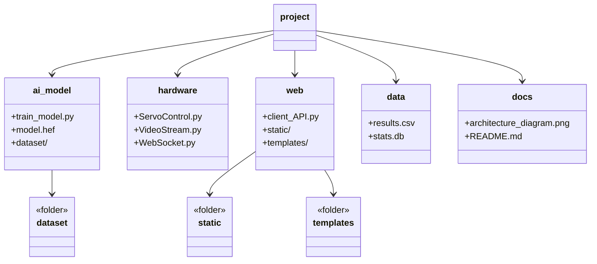

```mermaid
classDiagram
    class project {
    }
    %% AI MODEL
    class ai_model {
        +train_model.py
        +model.hef
        +dataset/
    }
    class dataset {
        <<folder>>
    }
    %% HARDWARE
    class hardware {
        +ServoControl.py
        +VideoStream.py
        +WebSocket.py
    }
    %% WEB
    class web {
        +client_API.py
        +static/
        +templates/
    }
    class static {
        <<folder>>
    }
    class templates {
        <<folder>>
    }
    %% DATA
    class data {
        +results.csv
        +stats.db
    }
    %% DOCS
    class docs {
        +architecture_diagram.png
        +README.md
    }
    project --> ai_model
    ai_model --> dataset
    project --> hardware
    project --> web
    web --> static
    web --> templates
    project --> data
    project --> docs
```

```mermaid
graph TB
    subgraph project["📦 project"]
        subgraph AI["📦 AI"]
            AI_traffic["AI_traffic_detection_hailo.py"]
            model_export["model_export.py"]
            yolov8m["yolov8m.hef"]
            pictures["📁 pictures/"]
        end
        subgraph hardware["📦 hardware"]
            ServoControl["ServoControl.py"]
            VideoStream["VideoStream.py"]
            servo_test["servo_test.py"]
            camera_test["camera_test.py"]
        end
        subgraph CLIENT_API["📦 CLIENT_API"]
            DatabaseManager["DatabaseManager.py"]
            client_API["client_API.py"]
            snapshots["📁 snapshots/"]
        end
        subgraph web_dashboard["📦 web_dashboard"]
            app["app.py"]
            static["📁 static/"]
            templates["📁 templates/"]
        end
        subgraph data["📦 data"]
            database["data.db"]
        end
    end
    AI -.->|<<import>>| hardware
    CLIENT_API -.-> |<<import>>| AI
    CLIENT_API -.->|<<access>>| hardware
    CLIENT_API -.->|<<access>>| data
    web_dashboard -.->|<<access>>| CLIENT_API
    web_dashboard -.->|<<access>>| data
    
    style project fill:#f0f0f0,stroke:#333,stroke-width:3px
    style AI fill:#e1f5ff,stroke:#01579b,stroke-width:2px
    style hardware fill:#fff3e0,stroke:#e65100,stroke-width:2px
    style CLIENT_API fill:#f3e5f5,stroke:#4a148c,stroke-width:2px
    style web_dashboard fill:#e8f5e9,stroke:#1b5e20,stroke-width:2px
    style data fill:#fce4ec,stroke:#880e4f,stroke-width:2px
```
