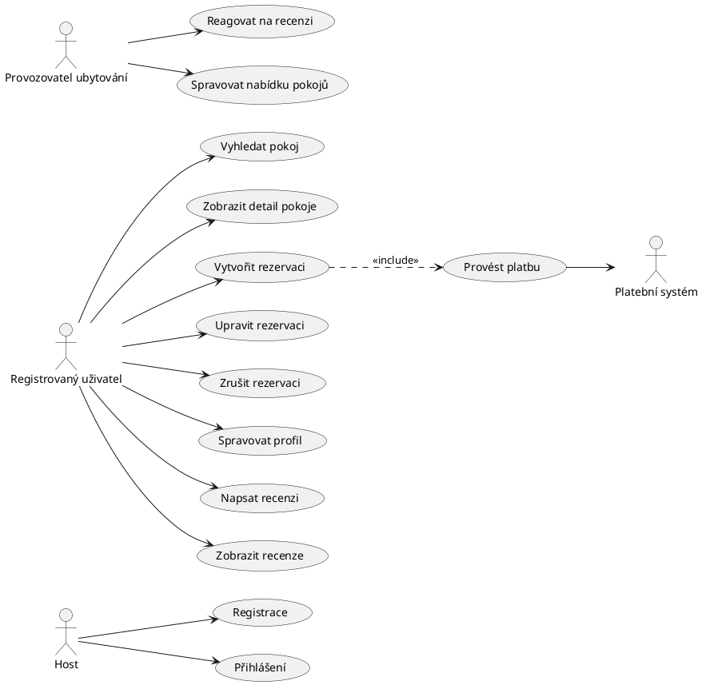
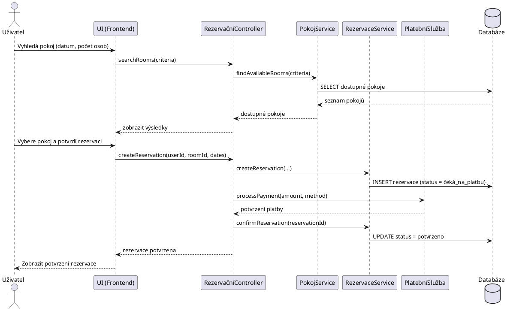
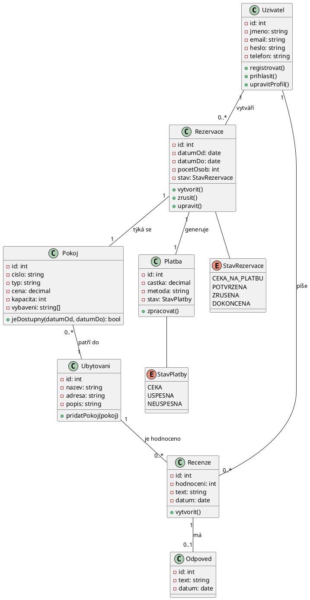

# Ukázková úloha V.1. Návrh rezervačního systému pro malé hotely a penziony

**Popis úlohy:** Navrhněte aplikaci pro rezervaci pokojů v malých hotelech a penzionech. Aplikace bude zahrnovat funkce pro vyhledávání pokojů, rezervaci, správu profilu uživatele a možnost poskytování zpětné vazby na ubytování.

**Požadavky na odevzdání:** Řešitel odevzdá softwarovou dokumentaci, která bude obsahovat systémový návrh ve formátu UML diagramů a snímky grafického prototypu ze softwaru Figma nebo drátěný model z libovolné grafické aplikace.

**Povinné UML diagramy:** Diagram případů užití, Sekvenční diagram, Diagram Tříd.
Návrh uživatelského rozhraní musí obsahovat alespoň: hlavní stránku, stránku rezervace, profil uživatele a formulář pro zpětnou vazbu. Návrh grafického rozhraní můžete realizovat ve formě webové, stolní nebo mobilní aplikace.

**Uživatelské požadavky:**

**Vyhledávání a rezervace pokojů:**
- Umožnit uživatelům vyhledávat pokoje podle data, počtu osob, ceny a dalších specifikací (např. wi-fi, snídaně).
- Poskytnout detailní informace o pokoji, včetně fotografií, popisu vybavení a recenzí od předešlých hostů.
- Umožnit uživatelům provést rezervaci pokoje, vyplnit potřebné údaje (jako jméno, kontakt, případné požadavky) a potvrdit rezervaci.\

**Správa profilu uživatele:**
- Umožnit uživatelům vytvořit a spravovat svůj uživatelský profil, včetně osobních informací.
- Nabídnout možnost změny hesla a osobních údajů.
- Poskytnout přehled předchozích a naplánovaných rezervací s možností zrušení nebo úpravy rezervace.

**Zpětná vazba a hodnocení:**
- Umožnit uživatelům hodnotit a psát recenze na ubytování.
- Zobrazit hodnocení a recenze hotelu/penzionu.
- Poskytnout hotelu/penzionu nástroj pro reagování na recenze a zpětnou vazbu.\

**Integrace platebního systému:**
- Nabídnout různé platební možnosti, jako jsou kreditní karty, bankovní převody a online platební platformy.\

**Uživatelské rozhraní a navigace:**
- Vytvořit intuitivní a přívětivé uživatelské rozhraní pro snadnou navigaci a používání aplikace.

# UML diagramy — Rezervační systém pro malé hotely a penziony
Tři povinné diagramy dle zadání úlohy V.1: **diagram případů užití**, **sekvenční diagram** a **diagram tříd**.

Kód je v jazyce PlantUML. Vykreslíte ho zdarma na https://www.plantuml.com/plantuml/uml/, nebo pomocí rozšíření "PlantUML" ve VS Code / IntelliJ.

---

## 1. Diagram případů užití (Use Case Diagram)

Aktéři: **Host** (nepřihlášený návštěvník), **Registrovaný uživatel**, **Provozovatel ubytování**, externí **Platební systém**.

**Poznámka k obsahu:** Vazba `<<include>>` mezi *Vytvořit rezervaci* a *Provést platbu* vyjadřuje, že platba je nedílnou součástí dokončení rezervace (bod 4 zadání – integrace platebního systému). Můžete přidat i `<<extend>>` vazbu mezi *Vytvořit rezervaci* a *Napsat recenzi* pouze pokud chcete zdůraznit, že recenzi lze psát jen po dokončeném pobytu.

---

## 2. Sekvenční diagram (Sequence Diagram)
Scénář: **vytvoření rezervace pokoje včetně platby.**

**Poznámka k obsahu:** Diagram odpovídá bodu 1 (rezervace pokoje) a bodu 4 (platební systém) zadání. Pokud chcete diagram rozšířit, můžete přidat alternativní větev (`alt`/`else` blok v PlantUML) pro případ neúspěšné platby.

---

## 3. Diagram tříd (Class Diagram)

**Poznámka k obsahu:** Třídy pokrývají všechny funkční oblasti zadání — uživatele a profil (bod 2), pokoje a ubytování (bod 1), rezervaci a platbu (bod 1, 4) a recenze s možností odpovědi provozovatele (bod 3). Enum `StavRezervace` a `StavPlatby` odpovídají stavovým přechodům, které byste jinak museli řešit samostatným stavovým diagramem (ten ale zadání pro tuto úlohu nevyžaduje — je povinný jen u úlohy V.2).

---

### Tip k odevzdání
Do dokumentace vložte u každého diagramu:
1. Vyrenderovaný obrázek (PNG/SVG export z PlantUML).
2. Krátký textový popis (2–3 věty), co diagram znázorňuje a proč jste zvolili dané třídy/aktéry/kroky.