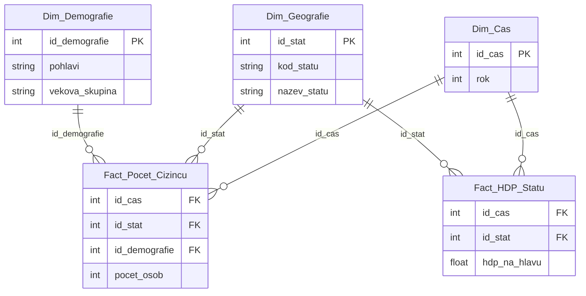

# OLAP 
**ER diagram**

**Vytvoření DW (Data Warehouse)**
```python
import duckdb
# Vytvoření lokální DuckDB databáze (uloží se do souboru, podobně jako SQLite)
con = duckdb.connect('datovy_sklad.duckdb')
# Fyzický návrh dimenzí
con.execute("""
    CREATE SEQUENCE seq_cas;
    CREATE TABLE Dim_Cas (
        id_cas INTEGER DEFAULT nextval('seq_cas') PRIMARY KEY,
        rok INTEGER
    );

    CREATE SEQUENCE seq_geo;
    CREATE TABLE Dim_Geografie (
        id_stat INTEGER DEFAULT nextval('seq_geo') PRIMARY KEY,
        kod_statu VARCHAR,
        nazev_statu VARCHAR
    );

    CREATE SEQUENCE seq_demo;
    CREATE TABLE Dim_Demografie (
        id_demografie INTEGER DEFAULT nextval('seq_demo') PRIMARY KEY,
        pohlavi VARCHAR,
        vekova_skupina VARCHAR
    );
""")
# Fyzický návrh tabulek faktů
con.execute("""
    CREATE TABLE Fact_Pocet_Cizincu (
        id_cas INTEGER REFERENCES Dim_Cas(id_cas),
        id_stat INTEGER REFERENCES Dim_Geografie(id_stat),
        id_demografie INTEGER REFERENCES Dim_Demografie(id_demografie),
        pocet_osob INTEGER
    );

    CREATE TABLE Fact_HDP_Statu (
        id_cas INTEGER REFERENCES Dim_Cas(id_cas),
        id_stat INTEGER REFERENCES Dim_Geografie(id_stat),
        hdp_na_hlavu DOUBLE
    );
""")
print("Struktura datového skladu byla úspěšně vytvořena v DuckDB.")
# Analytický dotaz (JOIN tabulek a agregace)[cite: 1]
dotaz = """
    SELECT 
        g.nazev_statu,
        c.rok,
        h.hdp_na_hlavu,
        SUM(f.pocet_osob) AS celkovy_pocet_cizincu
    FROM Fact_Pocet_Cizincu f
    JOIN Dim_Geografie g ON f.id_stat = g.id_stat
    JOIN Dim_Cas c ON f.id_cas = c.id_cas
    -- Zde je klíčové propojení: napojíme HDP na stejný stát a stejný rok
    JOIN Fact_HDP_Statu h ON h.id_stat = g.id_stat AND h.id_cas = c.id_cas
    GROUP BY 
        g.nazev_statu, 
        c.rok, 
        h.hdp_na_hlavu
    ORDER BY 
        h.hdp_na_hlavu DESC;
"""
# DuckDB umí výsledek dotazu okamžitě převést na Pandas DataFrame
vysledny_df = con.execute(dotaz).df()
print(vysledny_df.head())
```

Navrhl jsem model typu Star/Galaxy. Rozdělil jsem fakta do dvou tabulek, protože počet cizinců a HDP mají rozdílnou granularitu (zrnitost). HDP nezávisí na pohlaví a věku. Díky tomu, že obě tabulky faktů sdílejí společné dimenze (Čas a Geografie), mohu v OLAP nástroji jednoduše udělat dotaz (drill-down), který seskupí data cizinců podle HDP v zemích, kde mají občanství, přesně jak to požaduje zadání.

**OLTP (Online Transaction Processing):** Jedná se o běžné relační databáze (jako tvá PostgreSQL), které jsou navržené pro rychlé zapisování a úpravy velkého množství krátkých transakcí.  OLAP (Online Analytical Processing): Jde o systémy optimalizované pro čtení a agregaci historických dat pomocí složitých analytických dotazů. 

**OLAP (Online Analytical Processing):** Jde o systémy optimalizované pro čtení a agregaci historických dat pomocí složitých analytických dotazů

**Architektura multidimenzionálních OLAP databází - návrh OLAP databází se nedělí na klasické entity, ale na fakta a dimenze:** 
- Fakta: Obsahují měřitelné, kvantitativní metriky (například přesný počet cizinců nebo částku HDP) a cizí klíče.  
- Dimenze: Jsou to popisné atributy (kontext), podle kterých fakta řežeme a filtrujeme – například dimenze Čas (Rok, Měsíc), Geografie (Stát, Kraj) nebo Demografie (Věk, Pohlaví).  

**Architektura datových modelů OLAP:** 
- Star schema (Hvězda): Datový model má uprostřed jednu velkou tabulku faktů a kolem ní jsou přímo napojeny denormalizované tabulky dimenzí.  
- Snowflake schema (Vločka): Tabulky dimenzí jsou v tomto modelu dále normalizovány a větví se, takže model vizuálně připomíná vločku.

**Datové sklady (DW):** Centrální architektura pro celopodniková data sloužící jako jediný zdroj pravdy pro reporty.  
**Datová tržiště (DM):** Jsou menší a obsahují pouze specifický výsek datového skladu určený pro jedno konkrétní oddělení (např. marketing nebo HR). 

**Druhy OLAP přístupu**  
- ROLAP: Využívá relační databáze.
- MOLAP: Využívá předpočítané multidimenzionální struktury, tzv. datové kostky (cubes).
- HOLAP: Jedná se o hybridní přístup kombinující oba předchozí

**Vizualizace**
```python
import matplotlib.pyplot as plt
# Nastavení celkové velikosti grafu
plt.figure(figsize=(10, 6))
# Vytvoření bodového grafu (Osa X = HDP, Osa Y = počet cizinců)
plt.scatter(
    vysledny_df['hdp_na_hlavu'], 
    vysledny_df['celkovy_pocet_cizincu'], 
    color='steelblue', 
    alpha=0.7, 
    edgecolors='black'
)
# Nastavení popisků os a hlavního titulku
plt.title('Závislost počtu cizinců na HDP daného státu (Rok 2019)', fontsize=14, pad=15)
plt.xlabel('HDP na hlavu (lokální měna / USD)', fontsize=12)
plt.ylabel('Celkový počet cizinců (Logaritmická škála)', fontsize=12)
# V demografických datech bývají často extrémní výkyvy (jeden stát má miliony, jiný tisíce).
# Použití logaritmické škály na ose Y graf zpřehlední a body nebudou natlačené dole.
plt.yscale('log')
# Jemná mřížka na pozadí pro lepší čitelnost hodnot
plt.grid(True, linestyle='--', alpha=0.5)
# Přidání textového štítku k 5 státům s nejvíce cizinci
top_5_statu = vysledny_df.head(5)
for index, row in top_5_statu.iterrows():
    plt.annotate(
        row['nazev_statu'],
        (row['hdp_na_hlavu'], row['celkovy_pocet_cizincu']),
        xytext=(5, 5), 
        textcoords='offset points',
        fontsize=9
    )
# Vykreslení výsledného grafu na obrazovku
plt.show()
```